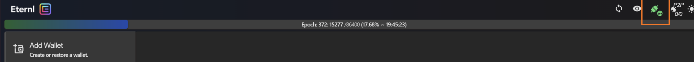

# Welcome to LoyalT
The Loyalty Points application aims to revolutionize the online shopping experience by rewarding users for browsing time on e-commerce sites like Amazon and Walmart. It features real-time point accumulation and conversion of points to tokens, enhancing user engagement and satisfaction. Users can view their blockchain wallet details, ensuring transparency in transaction tracking. This blockchain-based system, speeds up reward accumulation and redemption, similar to Singapore Airlines' versatile air mile points program. It eliminates intermediaries, providing a seamless and universally applicable reward system, thus boosting customer loyalty and platform usage.

## How to Connect
1. Choose from the various Cardano Wallets and download the browser extension:

    |         |                                        |
    |---------|----------------------------------------|
    | Eternal | https://ccvault.io/app/mainnet/welcome |
    | Lace    | https://www.lace.io/                   |
    | Nami    | https://namiwallet.io/                 | 

    Note: These are just some of the popular Cardano wallets, you can choose any other which you like but should be compatible with Cardano.

2. Currently the application leverages Cardano Testnet, so make sure that the wallet account you create is on **testnet network**.

3. Look for the **DApp intgration** option in your wallet which will allow you to integrate your wallet to the websites. (Latest wallets like Lace will automatically identify your application and will ask you to authorize it before integrating the wallet).

